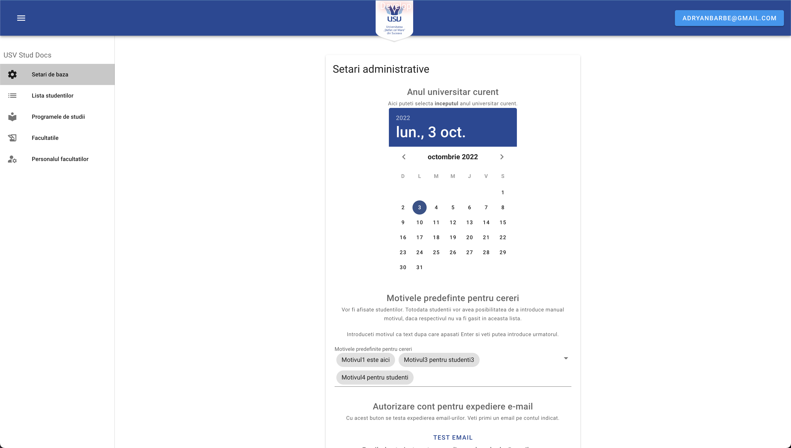

<a name="readme-top"></a>

[![MIT License][license-shield]][license-url]
[![LinkedIn][linkedin-shield]][linkedin-url]


<!-- PROJECT LOGO -->
<br />
<div align="center">
  <a href="https://github.com/adrianbarbe/usv-stud-docs">
    
  </a>

  <h3 align="center">USV StudDocs – facilitating interaction with your University</h3>

  <p align="center">
    An awesome software tool for interacting with the dean office for getting student's certificate!
    <br />
    <a href="https://github.com/adrianbarbe/usv-stud-docs/blob/master/README.md"><strong>Explore the docs »</strong></a>
    <br />
    <br />
    <a href="https://ulib.online"><strong>View Demo</strong></a>
    ·
    <a href="https://github.com/adrianbarbe/usv-stud-docs/issues">Report Bug</a>
    ·
    <a href="https://github.com/adrianbarbe/usv-stud-docs/issues">Request Feature</a>
  </p>
</div>


<!-- TABLE OF CONTENTS -->
<details>
  <summary>Table of Contents</summary>
  <ol>
    <li>
      <a href="#about-the-project">About The Project</a>
      <ul>
        <li><a href="#built-with">Built With</a></li>
      </ul>
    </li>
    <li>
      <a href="#project-design">Project Design</a>
    </li>
    <li>
      <a href="#implementation">Implementation</a>
    </li>
    <li>
      <a href="#deployment">Deployment</a>
    </li>
    <li>
      <a href="#getting-started">Getting Started</a>
      <ul>
        <li><a href="#prerequisites">Prerequisites</a></li>
        <li><a href="#installation">Installation</a></li>
      </ul>
    </li>
    <li><a href="#usage">Usage</a></li>
    <li><a href="#roadmap">Roadmap</a></li>
    <li><a href="#contributing">Contributing</a></li>
    <li><a href="#license">License</a></li>
    <li><a href="#contact">Contact</a></li>
    <li><a href="#acknowledgments">Acknowledgments</a></li>
  </ol>
</details>


<!-- ABOUT THE PROJECT -->
## About The Project
This is a piece of software which is aimed to facilitate the interaction with the dean office in USV. It uses USV Google oAuth2 authentication
which makes it even easier to use.


Admin user could do the managing for the dictionaries and basic settings:




Student would use the same auth screen and inside the app will see the list of already made requests and the button for creating a new one.


Dean office secretary will receive the certificate request and will follow up it according to the procedure.


<p align="right">(<a href="#readme-top">back to top</a>)</p>


### Built With

* [![.NET][.NET]][.NET-url]
* [![Vue][Vue.js]][Vue-url]
* [![PostgreSQL][psql]][psql-url]


<p align="right">(<a href="#readme-top">back to top</a>)</p>

## Project design

This project is build as a Client-API application with a client developed using the VueJs 3 front-end framework and API developed by using .NET 6 C#.
We used Entity Framework as main ORM and the chosen approach was Code First. This choice is dictated by the usability and maintainability of this approach. It creates uniform namings across the DB, there's no need to write down SQL code and maintain SQL code base.

The project is a solution that consists of 5 .NEt projects that corresponds to the architectural layers.

For this project we have chosen 3-tier / Layer architecure. It comprise of 3-tiers, Presentation Layer, Business Logic Layer, and Data Access Layer. Each Layer will have its own namespace, assembly and project (classes and folders)in the solution. 

We considered this architecture becuase there are some benefits of N-tier Architecture:
* Reuse of the code
* Improve of the Maintainability
* Looser Coupling

In our project we have next sub-projects:
* USVStudDocs.DAL - Data access layer, where the entity configurations, migrations and EF Context is saved.
* USVStudDocs.Entities – a class project where the Entities are grouped. They are suffixed by "*Entity"
* USVStudDocs.Models - a class project where the Data Transfer Objects (DTO) are located
* USVStudDocs.BLL - Business logic layer, a class project where the services and other business logic (authentication, 3rd party API integration, validation) is stored.
* USVStudDocs.Web – API project, presentation layer. A set of Controllers with exposed API endpoints, where the routing, authentication guards are implemented.
  USVStudDocs.UI – UI project, VueJs. Is what the user could see.

## Implementation

Some notable libraries (NuGets) used in our application are:
* FluentValidation – for DTO validation
* RestSharp - for sending API requests during the validation of oAuth2 code
* Serilog and Serilog.Sinks.Console and Serilog.Sinks.Telegram – for collecting and sending logs to console, and warnings and up – to Telegram.
* JWt - for generating user-facing JWT

#### Business layer

Business layer contains logic for Authentication, Custom Exceptions, Extension methods, Helpers, Mappes (between Entities and DTOs and vice-versa) and the most important – Services. 

Validators are created based on FluentValidation. 

Among services, there are CRUD Services for administration, for creating the certificate requeste, the sevices for use by dean office secretary.
There is also AwsMinioClient service that is used for uploading files to MinIO

Some notable places in BLL are:
* use of ```IHttpContextAccessor``` in BLL for getting the current user.
```c#
var subValue = _httpContextAccessor.HttpContext.User.FindFirst(JwtRegisteredClaimNames.Sub)?.Value;

            bool parseRes = int.TryParse(subValue, out var userId);

            if (!parseRes)
            {
                Log.ForContext<AuthorizationService>().Error("Cannot parse user Id from {SubValue}", subValue);
                
                throw new ValidationException("User id is not an integer");
            }

            return userId;
        }
```


* JWT generation

```c#
var jwtSecretKey = Environment.GetEnvironmentVariable("JwtSecretKey") ?? _jwtSettings.SecretKey;

        var tokenBuilder = new JwtBuilder()
            .WithAlgorithm(new HMACSHA256Algorithm())
            .WithSecret(jwtSecretKey)
            .AddClaim(JwtRegisteredClaimNames.Exp,
                DateTimeOffset.UtcNow.AddMinutes(_jwtSettings.ExpirationMinutes).ToUnixTimeSeconds())
            .AddClaim(JwtRegisteredClaimNames.Iss, _jwtSettings.Issuer)
            .AddClaim(JwtRegisteredClaimNames.Aud, _jwtSettings.Audience)
            .AddClaim(JwtRegisteredClaimNames.Sub, userEntity.Id)
            .AddClaim(JwtRegisteredClaimNames.UniqueName, userEntity.Username)
            .AddClaim(JwtRegisteredClaimNames.Email, userEntity.Email)
            .AddClaim(JwtRegisteredClaimNames.Iat, DateTimeOffset.UtcNow.AddMilliseconds(1).ToUnixTimeSeconds());
        
        tokenBuilder.AddClaim("role", roles);
            
        return tokenBuilder.Encode();
```

* Splitter of the Surname, Patornymic initials and name

  ```c#
  var studentSurnameNamePatronymic = res.Result.SurnameNamePatronymic.Trim()
                        .Replace("`", "'").Replace("'", "'")
                        .Replace("’", "'").Replace("  ", " ")
                        .Split(" ");

                    List<string> surname = new List<string>();
                    List<string> name = new List<string>();
                    List<string> patronymic = new List<string>();

                    foreach (var studentString in studentSurnameNamePatronymic)
                    {
                        if (!studentString.Contains('.') && patronymic.Count == 0)
                        {
                            surname.Add(studentString);
                        }
                        else if (studentString.Contains('.') && patronymic.Count == 0)
                        {
                            patronymic.Add(studentString);
                        }
                        else if (!studentString.Contains('.') && patronymic.Count > 0)
                        {
                            name.Add(studentString);
                        }
                    }

  ```

  * Authorizing e-mail service to use Gmail account
    
```c#
    
  var clientSecrets = new ClientSecrets
        {
            ClientId = clientId,
            ClientSecret = clientSecret
        };
        
        var token = new TokenResponse
        {
            AccessToken = accessToken,
            RefreshToken = refreshToken
        };

        var credential = CreateUserCredential(clientSecrets, token, oAuthEmailSenderEmail.Value);

        // Check if the access token has expired
        if (credential.Token.IsExpired(credential.Flow.Clock))
        {
            // Refresh the access token
            if (credential.RefreshTokenAsync(CancellationToken.None).Result)
            {
                accessToken = credential.Token.AccessToken;
                oAuthEmailAccessToken.Value = accessToken;
                _context.Settings.Update(oAuthEmailAccessToken);
                
                refreshToken = credential.Token.RefreshToken;
                oAuthEmailRefreshToken.Value = refreshToken;
                _context.Settings.Update(oAuthEmailRefreshToken);

                _context.SaveChanges();
            }
            else
            {
                throw new Exception("Failed to refresh access token.");
            }
        }

        var service = new GmailService(new BaseClientService.Initializer
        {
            HttpClientInitializer = credential
        });
```

## Deployment

For the project deployment we used Docker containers. In ```Docker_files``` you'll find configurations for the API and UI. 

One of the simplest ways to run the app on the server is running by the means of Docker Swarm, using docker-composer.yml. As a server we used Ubuntu Server 22.04, and ```nginx``` as a reverse-proxy server. The following instruction will be for Ubuntu 22.04.

1. Please install Docker engine.
```sh
sudo apt-get update
sudo apt-get install docker-ce docker-ce-cli containerd.io docker-buildx-plugin docker-compose-plugin
```
* you may not like to use "sudo" every time you execute Docker commmands.

If you want to omit this, then execute the following:

```sh
sudo groupadd docker
sudo gpasswd -a $USER docker
```

2. Initialize the Swarm:
```sh
sudo docker swarm init
```
Make a note of the command output, as it will contain the token needed to add other nodes to the Swarm.

3. Create a directory on your home directory or another which you prefer (e.g. ```/home/usv-stud-docs```)

3. Copy the file ```docker-compose.yml``` to this directory on the server.

4. Update the ENVs in the docker-compose.yml.

    - ```POSTGRES_PASSWORD``` - the desired PostresDB instance password.
    - ```ASPNETCORE_ENVIRONMENT``` - to Development or Production
    - ```DbConnectionString``` - according to this sample: ```Host=<host ip>;Port=15432;Database=usv-stud-docs;Username=usv-user;Password=<password>``` indicated in ```POSTGRES_PASSWORD```
    - ```GoogleClientId``` - which you obtained by visiting https://console.cloud.google.com/apis/credentials and creating oAuth2 credentials (after you created the project)
    - ```GoogleClientSecret``` - the secret from the previous place
    - ```GoogleRedirectUri``` - should correspond to the one indicated in Google Console, and should be according to this sample: https://<host_name>/auth/redirect
    - ```GoogleEmailRedirectUri``` - this is used for authorizing for sending emails, should correspond to the one indicated in Google Console, and should be according to this sample: https://<host_name>/auth/redirect
    - ```JwtSecretKey``` - a random string 16-32 chars length
   
5. Create new directory called ```db```, assign the ownership to the user that will run the app (e.g. usvdocs) and assign 777 access rights.

```sh
mkdir db
sudo chown usvdocs db
sudo chmod 777 db
```

6. In real-world scenario you'd need to push the Docker image to your own private DockerHub, where the Docker images are stored. In our case, you could use the already stored public images, that are indicated in the ```docker-compose.yml``` (this needs no changes). This would require to exeute ```docker login -u {username}``` commane.

7. You need to start your services by executing next command:

```sh
docker stack deploy --compose-file docker-compose.yml usv-docs --with-registry-auth
```

8. You may want to check the services status:

```sh
docker service ls
```

9. After the services were created, please connect to the DB (postgresql), don't forget to use the corresponding port from the docker-compose.yml and exeucte the file ```USVStudDocs.DAL/MigrationSQL/migration.sql```.
10. After this your app instance will be populated with the data structure and the initial data.
11. You may want to set-up the load balancer, to serve the L7 network, e.g. nginx. You could find a sample Nginx set-up in Docker_files/nginx_lb/usvstud.conf which should be places in ```/etc/nginx/sites-available``` and then a symbolic link (```ln -s```) should be created to ```/etc/nginx/sites-enabled```.
12. You may also want to install some LetsEncypt SSL cetificates in case no other options are available:

```sh
sudo snap install core; sudo snap refresh core
sudo snap install --classic certbot
sudo ln -s /snap/bin/certbot /usr/bin/certbot
sudo certbot --nginx
```

<!-- GETTING STARTED -->
## Getting Started

This is a description of how you should run up this project locally.
To get a local copy up and running follow these simple example steps.

### Prerequisites

First of all, make sure you have installed NodeJs major version 16. 
You could download it from the [official site](https://nodejs.org) or by using [nvm](https://github.com/nvm-sh/nvm).
I highly recommend you to use Yarn as a package manager tool. Please install it by next command:
```sh
npm install --global yarn
```

Here you could see the Swagger API documentation for the back-end end-points:
<a href="https://api.ulib.online/docs"><strong>View API documentaion</strong></a>


### Installation

_There are two projects in the Git repository – UI and API. You'll find the UI project into RemoteFinder.UI directory._

1. 
   ```sh
   git clone https://github.com/adrianbarbe/RemoteFinder.git
   ```
2. Install the NPM packages by executing 
   ```sh
   yarn install
   ```
3. Run the project for development
   ```sh
   yarn serve
   ```

_To run the API project, you'll need to create a .env file in RemoteFinder.Web with the following keys:_
1. ```ASPNETCORE_ENVIRONMENT``` which could be ```Development``` or ```Production```
3. ```DbConnectionString``` the connection string to your PostgreSQL database engine installation.
4. ```GoogleClientId``` is the client id for the Google oAuth2 Credentials. For creating new credentials please access [Google Developers Console](https://console.cloud.google.com/apis/credentials)
5. ```GoogleClientSecret``` client secret generated in Google Developers Console
6. ```GoogleRedirectUri``` redirect URI which you indicated in the Google oAuth2 application settings
7. ```GoogleEmailRedirectUri``` redirect URI for email sending, which you indicated in the Google oAuth2 application settings
8. ```JwtSettings:SecretKey``` and ```JwtSecretKey``` – a hash string for JWT tokens.

After creating the .env file you could start your project locally by running ```dotnet run``` command or by using the configuration profile for JetBrains Rider which is stored in the project repository.

### Deployment
In the project root you'll find a directory ```Docker_files``` that contains Docker definitions for projects and a ```docker-compose.yml``` file. You could use it for deploying the project into a Docker Swarm cluster. You could create it by installing Docker on the server and initialize a Swarm by ```doker swarm init``` command. Then, by placing the ```docker-compose.yml``` file in the desired directory, execute next command to initialize the Docker Swarm services: 
```sh
docker stack deploy --compose-file docker-compose.yml usv-docs --with-registry-auth
```
 Don't forget to update correspondingly 
the environment variables in the ```docker-compose.yml``` file for ```be``` service. 

<p align="right">(<a href="#readme-top">back to top</a>)</p>


<!-- USAGE EXAMPLES -->
## Usage
Here you could see the usage examples for the student.

<a href="https://ulib.online"><strong>View the Demo Here  »»»</strong></a>


To add a new request for a certificate to your dean office just click the main button above the list of the request and you'll see this Add New Certificate request modal:


By default student will see the list of already made the requests. Stuent is able to add new request only then the previous one was solved: 


<p align="right">(<a href="#readme-top">back to top</a>)</p>


<!-- ROADMAP -->
## Roadmap

- [x] Add Basic functionality
- [x] Add Multiple Faculties
- [x] Add possibility to check the status of the certificate request
- [x] Receive email when the status is changed
- [x] Administration of the data from the UI
- [ ] Make mobile-ready web-version
- [ ] Multi-language Support


See the [open issues](https://github.com/adrianbarbe/usv-stud-docs/issues) for a full list of proposed features (and known issues).

<p align="right">(<a href="#readme-top">back to top</a>)</p>


<!-- CONTRIBUTING -->
## Contributing

Contributions are what make the open source community such an amazing place to learn, inspire, and create. Any contributions you make are **greatly appreciated**.

If you have a suggestion that would make this better, please fork the repo and create a pull request. You can also simply open an issue with the tag "enhancement".
Don't forget to give the project a star! Thanks again!

1. Fork the Project
2. Create your Feature Branch (`git checkout -b feature/AmazingFeature`)
3. Commit your Changes (`git commit -m 'Add some AmazingFeature'`)
4. Push to the Branch (`git push origin feature/AmazingFeature`)
5. Open a Pull Request

<p align="right">(<a href="#readme-top">back to top</a>)</p>


<!-- LICENSE -->
## License

Distributed under the GNU GPL License. See `LICENSE.txt` for more information.

<p align="right">(<a href="#readme-top">back to top</a>)</p>


<!-- CONTACT -->
## Contact

Adrian Barbe - [@adryanbarbe](https://twitter.com/adryanbarbe) - adryanbarbe@gmail.com

Project Link: [https://github.com/adrianbarbe/usv-stud-docs](https://github.com/adrianbarbe/usv-stud-docs)

<p align="right">(<a href="#readme-top">back to top</a>)</p>


<!-- ACKNOWLEDGMENTS -->
## Acknowledgments

* [Choose an Open Source License](https://choosealicense.com)
* [Img Shields](https://shields.io)
* [Vuetify](http://next.vuetifyjs.com)

<p align="right">(<a href="#readme-top">back to top</a>)</p>


<!-- MARKDOWN LINKS & IMAGES -->
<!-- https://www.markdownguide.org/basic-syntax/#reference-style-links -->

[license-shield]: https://img.shields.io/badge/GNU%20GPL-GNU%20GPL-green?style=for-the-badge
[license-url]: https://github.com/adrianbarbe/usv-stud-docs/blob/master/LICENSE.txt
[linkedin-shield]: https://img.shields.io/badge/-LinkedIn-black.svg?style=for-the-badge&logo=linkedin&colorB=555
[linkedin-url]: https://linkedin.com/in/adryanbarbe
[product-screenshot]: USVStudDocs.UI/_screenshots/scr_1.png

[Vue.js]: https://img.shields.io/badge/Vue.js-35495E?style=for-the-badge&logo=vuedotjs&logoColor=4FC08D
[Vue-url]: https://vuejs.org/
[.NET]: https://img.shields.io/badge/-.NET%206.0-blueviolet?style=for-the-badge
[.NET-url]: https://dotnet.microsoft.com/en-us/download/dotnet/6.0
[psql]: https://img.shields.io/badge/PgSQL-PostgreSQL-blue?style=for-the-badge
[psql-url]: https://img.shields.io/badge/PgSQL-PostgreSQL-blue?style=for-the-badge
